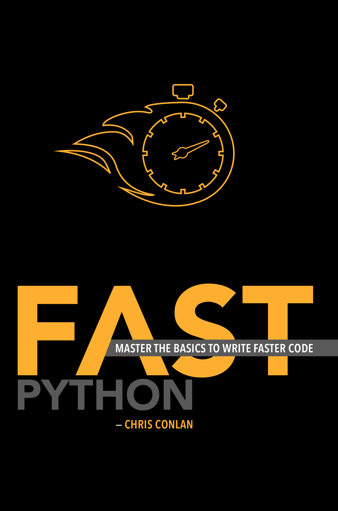

# Fast Python
Source code for Fast Python (2020) by Chris Conlan

Paperback available for purchase [on Amazon](https://amzn.to/2XmvJ3x).

---------------

#### Code profiles

The following code profiles can be run as stand-alone scripts. They may or may not depend on explanation provided in the accompanying book.

+ Binary search: [binary_search.py](src/binary_search.py)
+ Dictionary construction: [build_dict.py](src/build_dict.py)
+ Concatenating strings, string construction: [concatenate_strings.py](src/concatenate_strings.py)
+ Counting the frequency of a value: [count_occurrences.py](src/count_occurrences.py)
+ Computing a cumulative sum: [cumulative_sum.py](src/cumulative_sum.py)
+ The `in` operator and early stopping: [early_stopping.py](src/early_stopping.py)
+ Time series filters/convolutions: [filters.py](src/filters.py)
+ Find largest `k` values in a list: [find_top_k.py](src/find_top_k.py)
+ List construction/declaration/flattening: [flatten_lists.py](src/flatten_lists.py)
+ Counting lines in a file: [line_count.py](src/line_count.py)
+ Set intersection, finding matches in a list: [match_within.py](src/match_within.py)
+ Matrix multiplication: [matrix_multiplication.py](src/matrix_multiplication.py)
+ Computing moving averages: [moving_averages.py](src/moving_averages.py)
+ Counting frequency of a word in text: [occurrences_of.py](src/occurrences_of.py)
+ Looping through `pd.DataFrame` objects: [pandas_loops.py](src/pandas_loops.py)
+ Sorting algorithms: [sorting.py](src/sorting.py)
+ Low-level sorting algorithms: [sorting_v2.py](src/sorting_v2.py)
+ Adding a list of numbers: [sum.py](src/sum.py)

----

